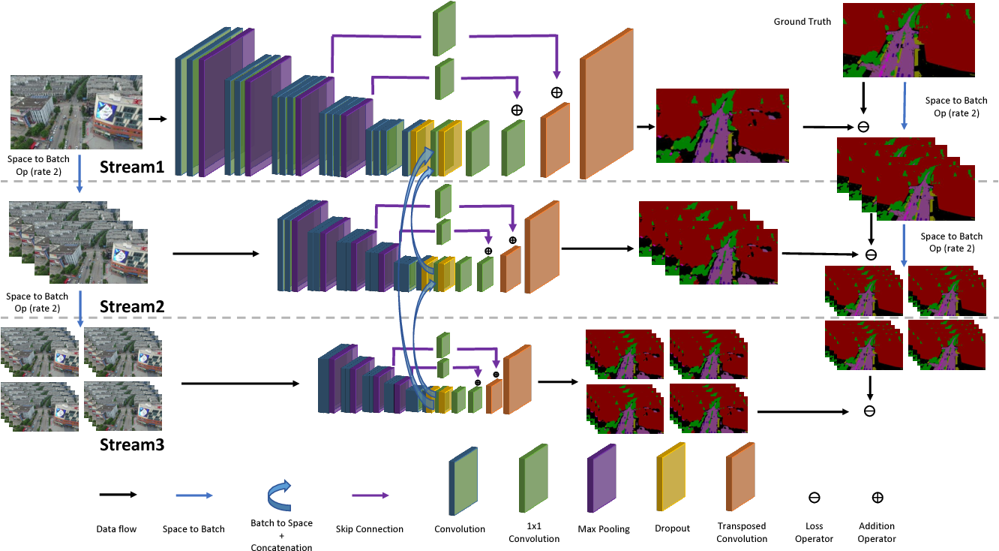

# MSDNet
Multi-Scale-Dilation Net is a deep neural network designed for semantic segmentation task, which integrates multi-scale 
feature extraction by the dilated convolution and the reduced FCN8s backbone. It serves as one of the baseline methods 
for the UAVid dataset.



### Preparation

First, clone the repository and go to the MSDNet folder.

```git clone https://github.com/YeLyuUT/MSDNet.git```

```cd MSDNet```

##### Add UAVid dataset to data folder

```mkdir data```

```ln -s <path to UAVid dataset> data/uavid```

##### Initialization (Create the folders and txt files)
```bash init.sh```

##### Prepare cropped data for training (skip if you do not need training)
```python toolkit/getCroppedTrainData.py```

##### Install tensorflow
Our model is tested with early tensorflow1.3 version and python2.7

You can follow the instruction on the official site to download. 

Link: https://www.tensorflow.org/install/pip?lang=python2

### Usage
##### Training

```python LMain_msd.py -m t -f fileListTrainCropped.txt```

##### Fine-tuning

```python LMain_msd.py -m t -f fileListTrainCropped.txt -w <checkpoints>```

##### Fine-tuning with decoder re-initialized

```python LMain_msd.py -m tp -f fileListTrainCropped.txt -w <checkpoints>```

##### Testing

```python LMain_msd.py -m p -f fileListTest.txt -w <checkpoint weight>```

##### Pretrained model

We offer the pretrained weights in the google drive link below, which should give 57.0% mIoU score on the UAVid2020 benchmark.

https://drive.google.com/drive/folders/1TzWeAu9Kb3Eqh3Y2YdyZ-3g4_zJinhvA?usp=sharing

Simply download the checkpoint files to the 'checkpoints' subfolder, and run the following command,

```python LMain_msd.py -m p -f fileListTest.txt -w checkpoints/model.ckpt```

### Citation
Please cite our paper if you find the work useful.

    @article{LYU2020108,
        author = "Ye Lyu and George Vosselman and Gui-Song Xia and Alper Yilmaz and Michael Ying Yang",
        title = "UAVid: A semantic segmentation dataset for UAV imagery",
        journal = "ISPRS Journal of Photogrammetry and Remote Sensing",
        volume = "165",
        pages = "108 - 119",
        year = "2020",
        issn = "0924-2716",
        doi = "https://doi.org/10.1016/j.isprsjprs.2020.05.009",
        url = "http://www.sciencedirect.com/science/article/pii/S0924271620301295"}
